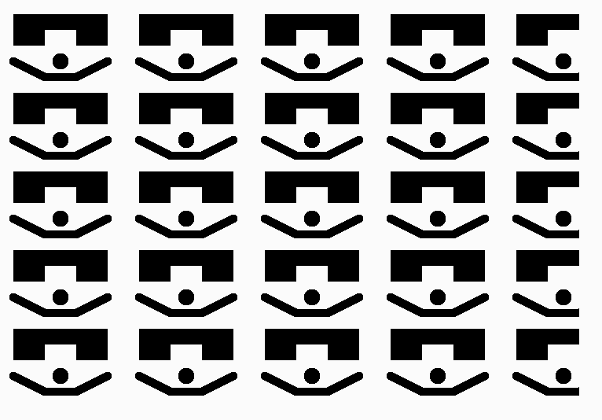

# Midterm - Clifford Strong II
## For this assignment we were tasked with making our own visuals within the bind of the javaScript language p5.js. 
## I did this by first sketching out what i wanted to have the code eventually draw. I settled on a guy wearing sunglasses, as it fit the three shape requirement that the assignment permited. I then experimented with getting the correct variables to write each piece of code for each little square or line. It was quite difficult trying to get this part right as it seemed at first random what some of the variables were from shape to shape, but i eventually got the hang of it and gave my sungalssed friend life. I then had to set the parameters and base of my functions. I had to expand the canvas, create the parameters for scale, push and pull, all quite striaght forward. with few issues. Then finally came making the grid. This is where i had the most difficulty. I could not for the life of me figure out how to use a nested for-loop in this whole code and make it work. I kept running into things being "undefined" even when that clearly was not the case. I eventually got so frustrated with it, that i decided to go a different route. Writing a line of code for every single instance of the picture, using drawObject, until i had a 5x5 grid. 
#  
### I sourced all of my code from two sources, the [class repository](https://github.com/rdwrome/261fa25/blob/main/05Functions/codealong.js) and from the [p5.js website](https://p5js.org/reference/) 
### I really could not figure out the nested loops, i feel as if there is some step i went wrong but i cant be for sure. 